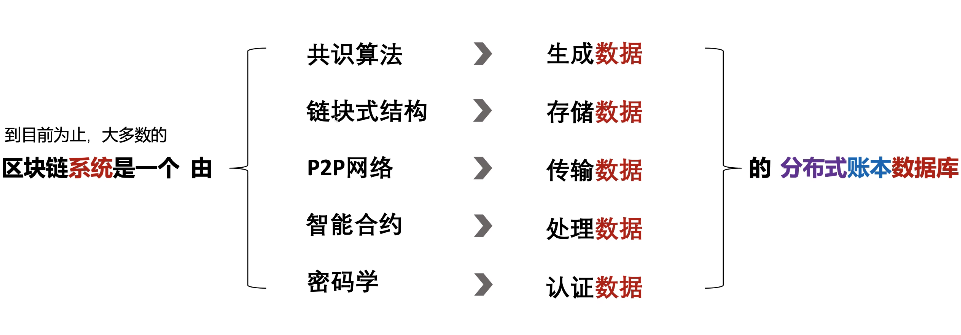
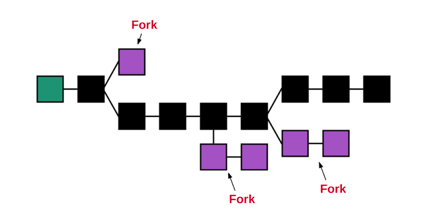
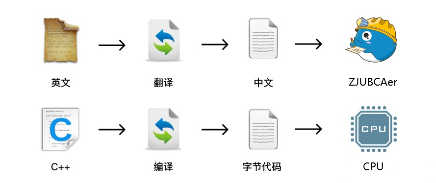
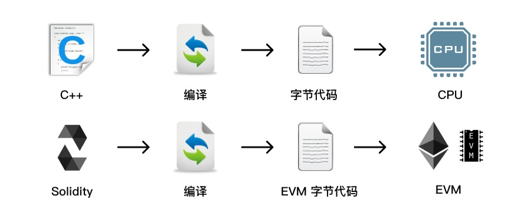
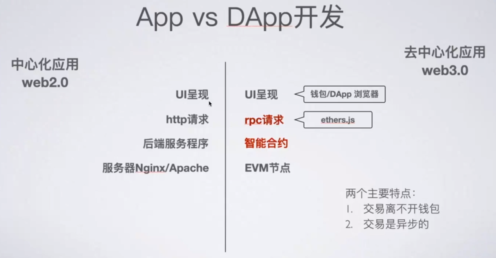

# 初探以太坊 Dapp 开发

BY ZJUBCA

本文假设读者已经对区块链有了基本的概念，如果你对诸如区块链、智能合约与 Dapp 这类词语完全陌生，那么我们建议读者先阅读协会的：[🔗ZJUBCA-Roadmap](../index.md)

## 以太坊技术原理

### 一、什么是以太坊（Ethereum）

对以太坊的定义往往仁者见仁，但如果集大成来解释，以太坊是基于状态转换的「世界计算机」（所有人都可以访问并使用的计算机，不受空间限制）

从计算机科学的角度来看，以太坊是一种确定但无界的由交易驱动的「状态机」（改变程序或系统保存的信息并保持共识的机体），它由全局可访问的离散单个状态和将变化应用于这种状态的虚拟机组成；从更实际的角度来看，以太坊是一种开源、在全球范围内呈去中心化并且能够执行「智能合约」（下文会详述，可简单理解为代码）的基础设施。

在以太坊平台上，开发人员能够构建具有内置经济功能的强大的去中心化应用程序。它使用区块链来同步和存储系统的状态变化，并使用一种被称为「以太币」（Ether）的加密货币来计量和限制执行资源成本，提供了高可用性，可审计性，透明性和中立性。

[🔗 以太坊白皮书](https://kauri.io/#collections/A%20Hackathon%20Survival%20Guide/ethereum-101-part-1-what-is-ethereum/)

### 二、深入理解以太坊技术原理

可能大家对上一节中提到的「状态机」的概念还有点模糊不清，为了让大家更清晰的深入到以太坊的技术原理中去，本节会以传统互联网为起点，循序渐进至以太坊的底层技术原理。

用计算机技术来说，以太坊就是一个保存了数字交易永久记录的「公共数据库」。重要的是，这个数据库不需要任何中间方来维护双方的权益。相反，它可以作为一种「无需信任」的交易系统来运作，也就是你可以在不需要第三方的情况下进行点对点（P2P）交易。



以太坊区块链本质上是一个为交易服务的状态机。在计算机科学中，一个状态机指的是这样一种东西，它可以读取一系列的输入，并基于这些输入产生一个新的状态。


以太坊状态机的运行从一个「元状态」开始，这类似于在网络上没有发生任何交易之前的一个空白匣子。当交易执行时，这个元状态就转变为一些最终状态。在任何时候，这个最终状态都代表着以太坊区块链的现状。


以太坊系统中运行着数百万笔交易，这些交易被分组归类为「区块」。每个区块由「区块头」（Header）和一系列「交易信息」(Transactions）组成。在这里，你可以简单地将区块头理解为一个包含决定区块链共识状态关键信息的 “数据集合”， 每个块只有通过对区块头的验证，才能与其前面的区块通过区块头串联在一起形成有向无环的链式结构。


前文中提到，以太坊是由交易驱动的状态机。那么要想以太坊正确的从一个状态转到另一个状态，必须证明交易是有效且真实的，否则以太坊便失去了其不需要第三方维护这一核心价值。要想证明一个交易是有效的，就必须通过一个验证过程，这一过程称为「挖矿」。

挖矿是指一组节点（即物理意义上的计算机）消耗它们的计算资源来创建一个有效交易的区块（这里仅以 Pow 为例）。网络中参与挖矿的节点被称为「矿工」。任何声明自己是「矿工」的节点都可以尝试创建和验证区块，全世界有许多矿工试图同时创建和验证区块。每个矿工在向区块链提交一个区块时同时，都要提供一个数学的证明，且把这个证明作为一个保证：如果这个数学证明存在，则该区块必然是有效的。

一个矿工如果想要在主区块链上添加一个合法区块，就必须比其他矿工更快地对其证明。那么，通过让矿工提供数学证明来验证每个区块的过程被称为「工作量证明」。

那么矿工为什么要消耗自己的计算机资源来验证并添加区块呢？答案是价值回报。任何完成这个验证工作的矿工都可以得到一定数额的价值回报。以太坊正是采用其链上数字货币「以太币」作为奖励。 每当一个矿工证明了一个区块，就会生成并得到一定数量的以太币。

正如我们在上文给区块链的定义，区块链是一个具有共享状态的交易状态机。这个定义决定了，区块链的当前状态是一个单一的全局状态，每个人都必须接受。如果拥有多个链（状态）会破坏整个系统，因为人们不可能就哪个状态是正确的状态达成一致意见。如果这些链是分开的，就会出现一个人在一条链上有 10 个以太币，在另一条链上有 20 个的情况。在这种情况下，我们没有办法确定哪一个链最「有效」，无法确定一个人有多少有效的以太币。

这一产生多条链的过程，被称为「分叉」（Fork）。因为分叉会破坏系统，因此我们通常会避免分叉，要求或者说迫使人们选择他们「相信」唯一有效的一条链。



为了确定哪个路径是最有效的，并防止分叉的发生，以太坊使用了一种叫做「GHOST 协议」的机制。简单地说，GHOST 协议让我们必须选择在链上做「最多计算」的路径。确定该路径的一种方法是通过计算每条链所使用最新区块的数量，来表示当前每条链上的区块总数（不包括创世区块）。块数越多，路径越长，则说明挖矿的难度越大，因此该链就为最多计算链。因此这个方法也可以被简称为「最长链原则」。通过这个方式，最终使每一个节点对当前区块链的状态（链）的唯一性达成共识。


到这里，我们就对以太坊区块链就有了一个宏观的认识。在这个链式架构的基础上，以太坊系统由如下所述的各主要组成部分支撑，如果你想更深入的了解这些，我们推荐你阅读以太坊黄皮书，不过请注意，他并没有那么易懂~

[🔗 以太坊黄皮书](https://gitcode.net/mirrors/wanshan1024/ethereum_yellowpaper)

-   帐户；
-   状态；
-   Gas 与费用；
-   交易；
-   区块；
-   交易执行；
-   挖矿；
-   工作量证明。

## Solidity 及 EVM

### 一、Solidity——面向合约对象的编程语言

Solidity 是由以太坊创始人之一的 Gavin Wood 所编写，是一门面向合约的、为实现智能合约而创建的高级编程语言。这门语言受到了 C++，Javascript 等语言的影响，属于静态类型语言，支持继承、库和复杂的用户定义类型等特性。其设计目的是为了能在以太坊虚拟机（EVM）上运行。

众所周知，以太坊之所以被称为区块链 2.0 的开山鼻祖，其中重要的一点就是实现了「图灵完备」。所谓图灵完备，就是一切可计算的问题都能计算，这样的虚拟机或者编程语言就叫图灵完备的，图灵完备通常指具有无限存储能力的通用物理机器或编程语言。那么与图灵完备相反的是图灵不完备，比如比特币的脚本系统，就是图灵不完备的。要想充分发挥以太坊图灵完备的优势，就要通过编写运行在 EVM 上（也可以理解为链上）的「智能合约」。那么 Solidity，就是编写智能合约的编程语言。

当然，除了 Solidity 以外，还有例如与 Python 接近的、文件名以.se 结尾 Serpent 编程语言也曾经流行过一段时间，除此之外也有开发者更喜欢使用 Vyper。但随着时间的推移和开发者们不断地学习和迭代，现在最成熟且应用最多的当数是 Solidity 了，因此这也是我们鼓励大家学习它的原因。

以下是通过 Solidity 编写的“Hello Wordl!”代码，其中，^0.8.0 是编译器的版本号，HelloWorld 是合约名，greet 是状态变量。

```solidity
// SPDX-Lisence-Identifier: MIT
// compiler version must be greater than or equal to 0.8.10 and less than 0.9.0
pragma solidity ^0.8.10;

contract HelloWorld {
  string public greet = "Hello World!";
}
```

如果你已经迫不及待的想要成为一名智能合约开发者，那么以下列出的学习工具一定有助于你：

-   Remix ---智能合约在线开发工具：[🔗](https://remix.ethereum.org)
-   Solidity 最新(0.8.0)中文文档：[🔗](https://learnblockchain.cn/docs/solidity)
-   Cryptozombies ---玩游戏的方式学习 Solidity：[🔗](https://cryptozombies.io)
-   Solidity by Example ---以太坊官方教程：[🔗](https://solidity-by-example.org)

### 二、EVM——基于堆栈的以太坊虚拟机

在了解 EVM 之前，首先清楚什么是虚拟机？传统的虚拟机指的是，通过软件模拟的，具备完整硬件系统功能，并运行在隔离环境下的完整计算机系统，比如 VMware、Java 虚拟机等。
那么什么是以太坊虚拟机呢？

以太坊虚拟机的英文全称为“Ethereum Virtual Machine”，简称为 EVM，这个 EVM 就是建立在以太坊区块链上的代码运行环境，是一个完全独立的沙盒，合约代码可对外完全隔离并在 EVM 内部运行，其主要作用是处理以太坊系统内的智能合约。上文提到的 Solidity 代码在部署到以太坊网络之前需要被编译成字节码。这个字节码所对应的底层机制，实际上就是 EVM 所解析的一系列操作码指令，然后由 EVM 根据此操作码，真正的完成代码的执行。

从传统互联网的角度来说，程序员在为一个软件编写程序时，会使用到编程语言，例如 C++。但 C++ 是计算机的 CPU 无法理解的高级语言。程序员通过 C++ 编写好的程序需要通过编译器翻译成 CPU 可以理解的语言，即字节代码（机器语言），从而对 CPU 发号施令让软件可以在计算机上顺利运行。

如果听到这里你觉得有些困惑，不必担心，坚持看完下面的例子，一定能“柳暗花明又一村”。

假设一名 ZJUBCAer 小蓝是一个英语盲，但作为一名区块链爱好者，它需要经常查看一些英语文章来及时掌握行业信息。为了解决语言障碍，它会把文章通过翻译软件转译成中文再阅读。



一篇用英语写成的文章被翻译为中文，变成了小蓝能看懂的语言，从而帮助小蓝能够轻松掌握区块链的行业信息。同理，一个用 C++ 编成的程序被编译为字节代码，变成 CPU 能看懂的语言，CPU 可以运行软件程序。
可这跟以太坊的 EVM 有什么关系？答案是，EVM 之于以太坊，就像 CPU 之于计算机。



以太坊是一台世界级计算机，但它毕竟不是实体电脑，也没有 CPU，那么智能合约要如何在以太坊上运行呢？EVM 就是以太坊的 CPU，以太坊开发者们通过编程语言 Solidity 写好的程序，被编译为 EVM 可以理解的 EVM 字节代码，EVM 就可以运行智能合约的程序。

到这里，相信你一定对 EVM 有了初步的认识，如果你想更进一步，那么我们建议你通过 EVM 练兵场，通过学以致用的方式，更好的掌握 EVM 的底层逻辑。

EVM 练兵场：[🔗](https://www.evm.codes/)

## 智能合约开发

什么是智能合约？其实通过上文的阅读，相信读者已经大概做到了心中有数，以太坊网络上运行程序就称之为智能合约，它和其他的程序一样，也是代码和数据(状态)的集合。

智能合约（Smart Contract）和人工智能（Artificial Intelligence ）的智能没有关系，智能合约最早由尼克萨博在 95 年提出，它的概念很简单，就是将法律条文写成可执行代码。让法律条文的执行中立化，这个理念和区块链上的程序可以不被篡改、不被干预（只有有人触发交易，它将自动执行）的执行不谋而合，因此区块链引入了这个概念。以太坊网络上运行程序就称之为智能合约。

### 一、以太坊客户端

大家都知道，如果想跟一个独立系统交互，仅仅编写了可以被该系统编译识别的代码还不够，还需要与该系统建立稳定的连接才能将数据传输过去。前文提到，以太坊虚拟机 EVM 是一个封闭的沙盒系统，其内部代码的运行是不受到外部世界的干扰的。那么，开发者如果想访问到以太坊并且期望与之交互应该怎么做呢？答案是通过以太坊客户端。

「以太坊客户端」是一个软件应用程序，它实现以太坊规范并通过 P2P 网络与其他以太坊客户端（节点）进行通信。如果不同的以太坊客户端符合参考规范和标准化通信协议，则可以进行相互操作。

以太坊是一个开源项目，由“黄皮书”正式规范定义。除了各种以太坊改进提案之外，此正式规范还定义了以太坊客户端的标准行为。因为以太坊有明确的正式规范，所以，任何一个独立开发的软件，只要实现了该范式，那他就可以作为一个以太坊节点，与以太坊或其它以太坊客户端交互。
目前以太坊客户端支持 8 种语言的客户端，这里推荐其中两款：

-   go-ethereum（geth）[🔗](https://github.com/ethereum/go-ethereum)：Golang 实现，官方推荐，开发使用最多
-   Parity[🔗](https://github.com/ethcore/parity/releases)：Rust 实现，最轻便客户端，在历次以太网攻击中表现卓越

### 二、开发框架

上文讲到，开发者如果想要跟以太坊交互，需要借助客户端来搭建节点才行。理论上虽然如此，但不禁想一下，如果每次开发都要手动搭建节点，且面向不同以太坊网络时还应重新搭建，未免给我们的开发增添了太多不必要的负担，对开发者的技术要求也更加严格，这显然是不利于以太坊乃至区块链技术的普及。

互联网软件开发的历史已有数十年之久。我们受益于半个世纪以来积累的最佳实践，设计模式和智慧。相反，智能合约开发才刚刚开始。2015 推出的以太坊和 Solidity 仅有几年的时间。在智能合约刚推出的前几年，没有确定的工具堆栈来帮助开发者部署智能合约以及构建去中心化应用。

但随着区块链技术的蓬勃发展以及广大开发者极客们的集思广益，诸如 Truffle、Hardhat 的 Dapp 开发框架应用的出现，极大的方便了开发者与区块链的交互，丰富了整个以太坊生态系统。

#### - Truffle

Truffle 是第一套基于以太坊的 Solidity 语言的成熟的开发框架。本身是基于 JavaScript。它对客户端做了深度集成，使开发、测试、部署都只需要一个命令行，可以在控制台使用命令行直接调用输出结果，方便调试。
Truffle 是本地编译、部署智能合约的框架；而向前文中提到的 geth 客户端连接的才是真正的以太坊环境；testrpc 是 Truffle 本地使用内存模拟的以太坊环境，关闭终端后，部署到 testrpc 的智能合约不会保存下来，对于开发调试更加方便，合约可以在 testrpc 中通过测试后，再部署到 geth 上，从而减少不必要的损失。

-   Truffle：[🔗](https://learnblockchain.cn/docs/truffle/quickstart.html)

#### - Hardhat

Hardhat 是一个编译、部署、测试和调试以太坊应用的开发环境。它可以帮助开发者管理和自动化构建智能合约和 dApps 过程中固有的重复性任务，并围绕这一工作流程轻松引入更多功能。
Hardhat 内置了 Hardhat 网络，这是一个专为开发设计的本地以太坊网络。主要功能有 Solidity 调试，跟踪调用堆栈、console.log()和交易失败时的明确错误信息提示等，其在智能合约的 Debug 调试过程的交互性要优于 Truffle。
除此之外，与 Truffle 不同的是，Hardhat 是一款基于插件的开发框架，其很多功能都来自于插件，开发者可以自由选择想使用的插件，甚至还可以将现有的 Truffle 项目迁移到 Hardhat 上。

-   Hardhat：[🔗](https://learnblockchain.cn/docs/hardhat/getting-started)

### 三、Dapp 开发

#### 什么是 Dapp?

App 我们都知道是客户端应用，是 application 的简称。DApp 就是 D+App，D 是英文单词 decentralization 的首字母，单词翻译中文是去中心化，即 DApp 为去中心化应用。

看到这里，大家思维中第一反应可能是，为什么要有 DApp，现在的 App 不是挺好吗？其实，两者并不是取代关系，而是并存关系，或者说 DApp 是对 App 的丰富和完善。因为 DApp 是依托于区块链底层技术的上层建筑，它和交易数据、交易资产有关联，和不可篡改去中心化存储也有关联，所以随着区块链技术越来越成熟普及，DApp 也更受到人们的青睐与期望，并更多地出现在各个生活场景中，如生产链防伪，捐款资金流向等等。



那么作为一名开发者，是开发一款自己的 Dapp 需要做的具体步骤是什么？
Dapp 的一般开发流程：

1. 创建自己的 Web3.0 钱包
2. 使用 Solidity 编写智能合约代码
3. 通过 Dapp 开发框架如 Hardhat、Truffle，通过 node.js 测试合约并部署
4. 编写前端界面，并通过如 ether.js、web3.js 与智能合约进行交互
5. 项目发布与测试

-   node.js 介绍文档：[🔗](https://www.runoob.com/nodejs/nodejs-tutorial.html)
-   ether.js 中文文档：[🔗](https://learnblockchain.cn/docs/ethers.js)
-   web3.js(1.0)中文文档：[🔗](http://cw.hubwiz.com/card/c/web3.js-1.0/1/1/1/)

## 常用工具及网站

### 一、数据查询

-   Etherscan ---以太坊区块链浏览器：[🔗](https://etherscan.io)
-   Ethereum Signature Database ---EVM 调用记录数据库：[🔗](https://www.4byte.directory)
-   ENS ---以太坊域名系统：[🔗](https://app.ens.domains)

### 二、合约开发

-   ChainIDE ---支持多链的在线合约开发工具：[🔗](https://chainide.com/zh-CN)
-   Chainlist ---EVM 网络列表：[🔗](https://chainlist.org/)
-   The Graph ---链上数据获取：[🔗](https://thegraph.com)
-   Chainlink ---第三方预言机：[🔗](https://docs.chain.link)
-   Alchemy ---第三方节点提供商：[🔗](https://dashboard.alchemyapi.io/signup/chain)

### 三、社区交流

-   登链社区 ---区块链开发者论坛：[🔗](https://learnblockchain.cn)
-   巴比特 ---区块链资讯平台：[🔗](https://www.8btc.com)
-   Ethereum ---以太坊基金会官方开发网站：[🔗](https://ethereum.org/en/developers)
-   Stack Overflow ---程序开发交流社区：[🔗](https://stackoverflow.com)
